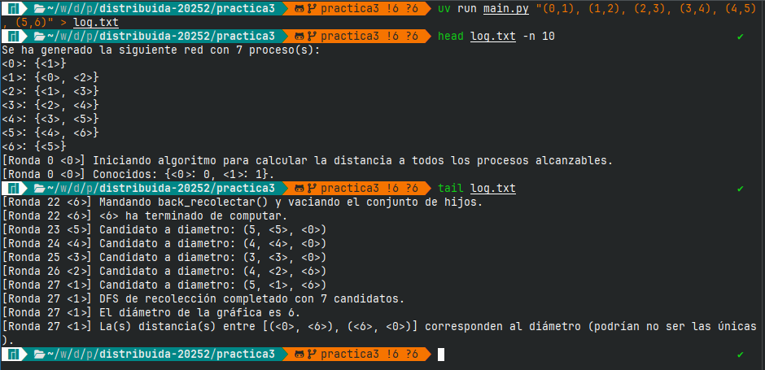
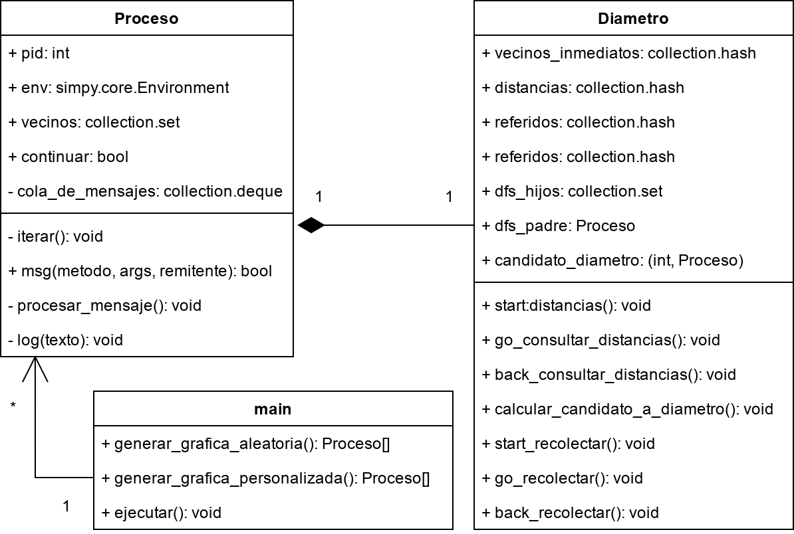

[^curso]: 2025-2, Grupo 7106. Profesor: Mauricio Riva Palacio Orozco. Ayudante: Adrián Felipe Fernández Romero. Ayudante de laboratorio: Daniel Michel Tavera.
[^alumno1]: [ahexo@ciencias.unam.mx](mailto:ahexo@ciencias.unam.mx) 
[^alumno2]: [jdu@ciencias.unam.mx](mailto:jdu@ciencias.unam.mx) 

# Ejecución
Se requiere de haber instalado previamente la biblioteca para Python *SimPy*. En esta realización se utilizó la versión 4.1.1.

Se espera al menos un argumento, el cual puede ser un número entero igual o mayor a 1:

```sh
python practica3.py 6
```
Si este es el caso, se generará una gráfica simple de grado 6, donde los 6 vértices (procesos) son conexos de una trayectoria del 1 al 6, con probabilidad de 50% de que exista una arista entre cualquier otro par de vértices.

También se puede ingresar una cadena especificando una lista lista de adyacencias de números enteros:
```sh
python practica3.py "(0,1), (0,2), (0,3), (0,4), (4,6), (6,5), (1,5), (1,7), (3,2)"
```

Las salidas del programa pueden ser muy largas debido a que todos los pasos en todas las rondas se reportan en pantalla. Si se está usando un sistema tipo UNIX, se recomienda vaciarlos en un archivo de texto para revisarlos con mas detalle (figura 1):

```sh
python practica3.py 16 > log.txt
```


Dado que por defecto, el programa genera gráficas con una tasa muy alta de adyacencias (50% de probabilidad entre cualquier par de vértices), en casi todos los casos donde la gráfica se construye de forma pseudoaletoria, esta tendrá un diámetro igual a 2. Por esta razón añadimos la opción de pasar ejemplares arbitrarios (Figura 2):



# Estructura

La práctica consta de tres clases `Diametro` y `Proceso` y `main`

## clase main

Es desde donde se debe de ejecutar el proyecto. Se espera un argumento de entrada, el cual puede ser un número entero o una cadena de adyacencias a como se detalló previamente.

La clase `main` hará uso de la biblioteca nativa `ast` para *parsear* la entrada recibida y determinar automáticamente de cual de los dos tipos se trata.

Luego, se la pasará a alguno de los dos métodos: `generar_grafica_aleatoria` en el caso de que la entrada sea un entero, o `generar_grafica_personalizada` si es una lista de aristas.

Ambos métodos devuelven un diccionario de Python donde las llaves son enteros para identificar a cada vertice (en adelante: proceso) y los valores son objetos de la clase `Proceso` que se detalla más adelante.

Una vez constuida la red, `main` estima el número de rondas que se estima va a tomar el primer algoritmo `consultar_distancias` en calcular las distancias entre todos los procesos en el peor de los casos: $nlog(n)$ donde $n$ es el grado de la gráfica.[^nota2]

[^nota2]: Esto lo hacemos así ya que `consultar_distancias` no tiene forma de detectar terminación, por lo que aprovechando que estamos trabajando en un supuesto síncrono con tiempo de transferencia de mensajes constante, le daremos las rondas suficientes para que toda la red calcule sus distancias al resto de procesos.

`main` ejecuta una simulación de SimPy por ese número de rondas y posteriormente un algoritmo DFS que construye un árbol en profundidad, y en la etapa de regreso (back) de este, le solicita a cada proceso su distancia mas larga construida en el primer algoritmo (su candidato a diámetro) para pasarselas a la raíz, quien va a hacer una operación local de comparación para decidir cual de todos estos es el mayor, y por ende, el diámetro de la red. Dado que toda gráfica generada debe tener al menos un proceso de índice 1, siempre nos tomaremos a este como la raíz.

## proceso

En esta clase definimos una clase de Python llamada `Proceso` que tiene una pila de mensajes (implementada usando la biblioteca `collections` de Python), los mensajes son tuplas de la forma:
```
(metodo: str, args: tuple, remitente: Proceso, self.env.now: int)
```
Donde `metodo` es el nombre del método que se solicita llamar en el proceso local, `args` es otra tupla conteniendo los parámetros requeridos por el método a llamar, `remitente` es una referencia al Proceso que manda el mensaje, y `self.env.now` la ronda del entorno de SimPy en que se recibió el mensaje. Esta última se usa para hacer verificaciones al momento de leer los mensajes y que un mensaje no se ejecute en la misma ronda que se recibió.

Para ser generado, cada proceso necesita al menos un ID y un entorno de SimPy al cual suscribirse.

El metodo principal de todos los ejemplares de esta clase es `iterar`, el cual es un ciclo while que se va a ejecutar en cada ronda nueva del entorno hasta que le sea indicado por medio de la variable booleana `continuar`. En cada uno de estos ciclos, va a vaciar la pila de mensajes, recoger el mensaje mas reciente de cada remitente distinto e intentar ejecutarlos. Todos los mensajes que sobren, se devuelven a la pila para procesarse en la siguiente ronda. 

Otros procesos pueden mandar mensajes a cualquier proceso por medio de la llamada `msg()`, que espera al menos una cadena con el nombre del método que se desea invocar en el proceso destinatario, una tupla de argumentos y una referencia al remitente. Los procesos sólo van a aceptar mensajes provenientes de procesos en su conjunto de vecinos.

Para efectos de la práctica, la clase `proceso` también incluye implementaciones arbitrarias para hacer comparaciones entre procesos de acuerdo a su ID, para representarse en consola con la notación `<n>` donde `n` es su ID, así como un método `log()` para reportar actividades en pantalla indicando la ronda y proceso que las realiza.


## diametro

Esta clase implementa una clase llamada `Diámetro` donde se definen los métodos que `Proceso` va a heredar para realizar el algoritmo que determine el diámetro de la red. El algoritmo en realidad se divide en dos fases: ``

### `start_distancias`
Se construye un diccionario con entradas de la forma `{proceso: distancia}`, que trivialmente se inicializa con el proceso que ejecuta el método teniendo (al que en adelante llamaremos origen) una distancia 0 y sus vecinos con distancia 1. 

Después, el origen propaga un mensaje `go_consultar_distancias` adjuntando copias de esta lista y preguntando a sus vecinos para agregar procesos que conozcan y no estén en la copia de la lista que les llegó, los cuales se añadirán con una distancia equivalente a la suya mas uno.

En una primera ronda, todos los procesos van a ejecutar este método por defecto.

### `go_consultar_distancias`
Se recibe la lista de distancias de algun proceso origen en la red, se hará una operación de diferencia de conjuntos para encontrar procesos en el conjunto de vecinos local que no estén en dicha lista, y se agregarán con una distancia equivalente a la del proceso que ejecuta este método en esa misma lista, mas uno.

Todos los procesos mantienen otra lista llamada `referidos` a modo de historial, donde guardan la referencia del proceso que les pasa el mensaje `go_consultar_distancias` de algun origen por primera vez. En caso de que el proceso origen ya se encuentre en esta lista, se emitirá un  `back_consultar_distancias`, pues quiere decir que ya se ha recibido antes otro mensaje de otro proceso en alguna ronda pasada preguntando por las distancias del mismo proceso, de modo que no tiene caso seguir buscando distancias, pues todas serían mas largas.

En el caso contrario, se agrega el origen a la lista de referidos y se sigue propagando el mensaje `go_consultar_distancias`.

### `back_consultar_distancias`
Se recibe la lista de distancias de algun proceso origen en la red, la cual se asume ya está completa.

Si el origen de esta lista es el proceso que la recibe, se convoluciona con otro diccionario `distancias` local desempatando a criterio de la menor distancia por cada proceso.

En otro caso, se sigue propagando el mensaje de regreso al proceso referido al origen en la lista local de referidos.

No sabemos de antemano cuantos mensajes de este tipo va a recibir un proceso, así que el algoritmo en realidad no detecta terminación, pero debería dar resultados correctos si se le deja correr por las rondas necesarias en el peor caso ($n log(n)$).

### `start_recolectar`
Pasado cierto número de rondas, un proceso distinguido (en nuestro caso, el que tenga el `ID=1`) ejecutará un algoritmo DFS para construir un árbol en profundidad a toda la red. Inicializará una lista de procesos visitados y se la va a pasar a algun vecino elegido arbitrariamente por medio de `go_recolectar`.

En la etapa de regreso de este, se le solicitarán a todos los procesos que devuelvan su distancia mas larga calculada en la etapa de `consultar_distancias`.

### `go_recolectar`
Un proceso recibe este mensaje, registra al remitente como su padre en el arbol DFS inducido, y compara la lista de visitados adjunta con su conjunto de vecinos. Si quedan vecinos sin visitar, propaga el mensaje `go_recolectar` a alguno de estos y lo registra como su hijo.

Si no quedan vecinos por visitar, calcula su distancia más larga y se la pasa junto con la lista de visitados a su padre por medio de `back_recolectar` y reporta terminación.

### `back_recolectar`
Cuando un proceso recibe un mensaje de este tipo, verifica si no le quedan vecinos sin visitar en la lista de visitados. Si es así, le pasa `go_recolectar` a alguno de ellos.

Si no quedan vecinos por visitar, calcula su distancia más larga, la pone en la lista de candidatos y se la pasa junto con la lista de visitados a su padre por medio de `back_recolectar` y reporta terminación.

Si quien recibe el mensaje es la raíz del árbol, y no le quedan vecinos sin visitar, quiere decir que acaba de recibir la lista con todos los candidatos a diámetro de la red. Selecciona al máximo o maximales de esta lista y los declara el diámetro de la red para posteriormente terminar el programa.

### `calcular_candidato_a_diametro`

Un método sencillo para seleccionar el máximo o algun maximal de la `distancias` sobre demanda.

# Diagrama



