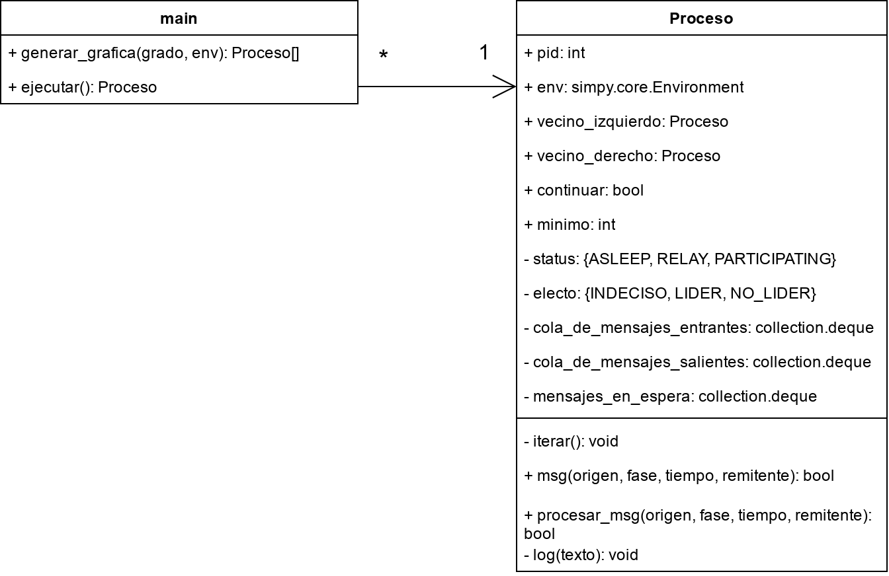

# Descripción general

Para este ejercicio, hemos retomado parte del código empleado en la praćtica anterior, en particular las clases `main` y `Proceso`, en particular esta última ha sufrido varias modificaciones:

1. Anteriormente, todos los procesos tenían un conjunto de vecinos, pero como en esta ocasión trabajaremos exclusivamente con la topología de anillo, ahora solo tendrá dos apuntadores al vecino izquierdo y derecho.
2. A diferencia de la práctica del cálculo del diámetro la cual tenía varias operaciones y tipos de mensajes que recibir (go y back), el algoritmo de elección del lider especificado requiere una sola operación para verificar si los mensajes recibidos tienen un ID mas bajo o no y de acuerdo a esta decidir si volverse lider o no, así como cuantos mensajes mantener o mandar. Es decir, no hace falta un sistema para determinar que mensajes ejecutar, porque todos tienen la misma nomenclatura y se procesan igual.
3. Se agregaron los siguientes atributos:
  - `cola_de_mensajes_salientes`: Una pila para guardar todos los mensajes que van a mandar "empaquetados" en uno solo al vecino correspondiente en cada ronda.
  - `status`: Puede tomar valores de `ASLEEP` si el proceso no está trabajando, `RELAY` si ya solo está pasando mensajes o `PARTICIPATING` si aún no decide si ser lider o no.
  - `electo`: Puede tomar valores de `INDECISO` por defecto, `NO LIDER` si ha recibido un mensaje con un ID menor al suyo, o `LIDER` si ha recibido un mensaje con su mismo ID.
  - `minimo`: El menor ID que ha visto.
  - `mensajes_en_espera`: Una pila para retener mensajes después de la primera fase que podrían servir de lider si es que no se ha decidido uno.
  
Por otro lado, la única modificación que la clase `main` ha visto reflejada es que el método `generar_grafica` ahora construye estrictamente una gráfica simple conexa no dirigida en forma de anillo, esto es, un camino donde todas las aristas tienen grado dos y forman un ciclo.
  


# Ejecución 
Como ya es costumbre, se inicia un entorno de Python con la biblioteca SimPy instalada. El programa espera como argumento un solo entero representando el grado del anillo a generar:

```sh
python practica4.py 5
```


Dado que la topología de anillo es formalmente definida como un único ciclo, el programa no admite entradas menores a 3, que es el grado mínimo que un ciclo puede tener en una gráfica simple no dirigida.

[^curso]: 2025-2, Grupo 7106. Profesor: Mauricio Riva Palacio Orozco. Ayudante: Adrián Felipe Fernández Romero. Ayudante de laboratorio: Daniel Michel Tavera.
[^alumno1]: [ahexo@ciencias.unam.mx](mailto:ahexo@ciencias.unam.mx) 
[^alumno2]: [jdu@ciencias.unam.mx](mailto:jdu@ciencias.unam.mx) 
